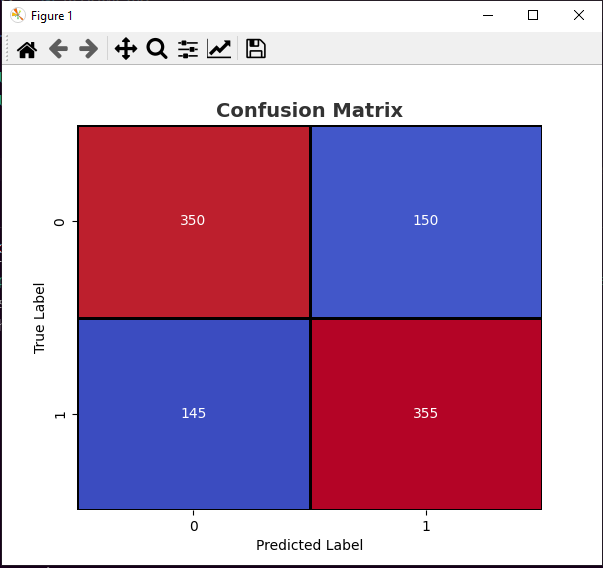

# 🐱🐶 Simple ANN Classifier

This project is a basic artificial neural network (ANN) implemented in Python to classify images of cats and dogs. It uses a single-layer logistic regression model trained with gradient descent to distinguish between the two classes.

## 📌 Features
- Simple logistic regression model (1-layer ANN)
- Uses `numpy` for numerical operations
- Implements visualization using `matplotlib` and `seaborn`
- Displays training loss and accuracy in real-time
- Generates a confusion matrix for evaluation
- Loads and processes data from `.hdf5` files
- Normal live visualization of training progress

## 📥 Dataset

The dataset is stored in HDF5 format and contains training and test sets for image classification.

## 🛠️ Installation

To set up the project, first, clone the repository and install the dependencies:
```bash
git clone https://github.com/yourusername/Simple-Cat-Dog-Classifier.git
cd Simple-Cat-Dog-Classifier
python -m venv venv
source venv/bin/activate  # On Windows use `venv\Scripts\activate`
pip install -r requirements.txt
```

## 🚀 Usage
1. Place the dataset files (`trainset.hdf5` and `testset.hdf5`) inside the `datasets/` folder.
2. Run the training script:

```bash
python app.py
```

3. The script will:
   - Load and preprocess the dataset
   - Train the ANN model with visualization
   - Display sample images and the final confusion matrix

## 📊 Model Overview
- **Initialization:** Random weight and bias assignment.
- **Activation Function:** Sigmoid function.
- **Loss Function:** Log-loss (Binary Cross-Entropy).
- **Optimization:** Gradient Descent.
- **Evaluation:** Accuracy score and confusion matrix.

## 📂 Project Structure
```
Simple-Cat-Dog-Classifier/
├── datasets/                # Folder containing the dataset (.hdf5 files)
├── app.py                   # Main script for training and testing
├── utilities.py             # Utility functions for loading data
├── requirements.txt         # Required dependencies
├── README.md                # Project documentation
```

## 🔥 Example Output
Sample visualization of training loss and accuracy:

```
Model Accuracy: 0.95
```

Confusion matrix of predictions:

  

## 📜 License
This project is open-source and free to use.

## 🤝 Contributions
Feel free to contribute by improving the model or adding new features!

---

Happy coding! 🐱🐶

